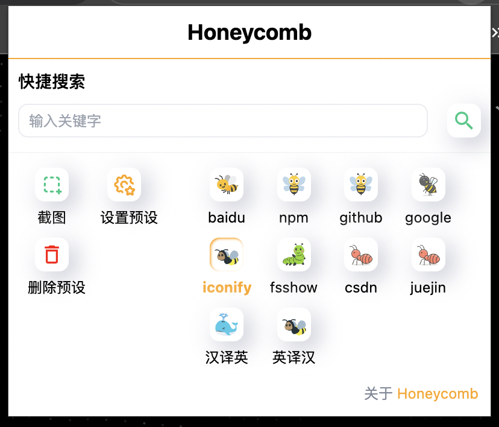

前几天在看抖音一个前端大佬的直播的时候，他最近一直在写一个关于`tailwindcss`的浏览器插件，突然来了兴趣，咦🤯，我能不能也写一个浏览器插件呢，于是我就开始研究了一下，发现了一个叫做`plasmo`的框架，它可以让我们用`React`来写浏览器插件，摸索着摸索着，就有了这个项目。起初这个项目的名字叫做`findDiff`,原本是想做一个浏览器截图的插件（使用浏览器插件的方式达到`snipaste`软件的功能），用于前端在写项目的时候方便更加直观的看到页面效果和ui设计稿的差距

我就写啊写，搜啊搜，写啊写，突然发现用浏览器器插件走这条路似乎走不通或者说是很难，因为我无法做到像软件一样，所截取的屏幕在不同的网页之间共享，也就是说切换网页后，插入`body`的这张截图就会消失，似乎没有意义...

后来换了很多方法，比如用`iframe`来嵌入截图，但是发现截图的`iframe`无法拖动，而且截图的`iframe`也无法在`iframe`中拖动，所以这个方法也失败了，有或者将截图的图片存入本地，但是也是竹篮打水一场空

有想法的同学，可以尝试一下，如果成功了，欢迎告诉我😊

...

最后我放弃了原先的想法，所以才有了`honeycomb`

## honeycomb

### 介绍

honeycomb 是一个基于 [plasmo](https://plasmo.com) 的浏览器扩展,用于在浏览器中快捷访问搜索一些网页站点内容。支持添加任何通过 url 中 get 参数搜索的网站。

### 为什么叫 honeycomb

honeycomb 是一种蜂巢状的结构，寓意着项目的简洁和易用性同时UI也更倾向于类似蜂巢。

### 安装1

1. 点击 [honeycomb](https://chromewebstore.google.com/search/honeycomb?hl=zh-CN&utm_source=ext_sidebar) 扩展商店
2. 点击 `Add to Chrome` 按钮

### 安装2

1. 打开 [honeycomb](https://github.com/zhengyuxiang/honeycomb) 仓库
2. 点击 `Code` 按钮
3. 点击 `Download ZIP` 按钮
4. 解压文件
5. 打开vscode 运行 pnpm install 安装依赖 并运行 pnpm build 构建项目
6. 点击 `更多工具` -> `扩展程序`
7. 打开 `开发者模式`
8. 点击 `加载已解压的扩展程序`
9. 选择 `honeycomb` --> `build` --> `chrome-mv3-prod` 文件夹

### 一键导入预设

- 点击 `设置预设` 按钮 弹出 `预设` 窗口
- 点击 `一键导入预设` 按钮即可，里面预设了一些常用的搜索网站

### 添加预设

- 点击 `设置预设` 按钮 弹出 `预设` 窗口
- 点击 `添加预设` 按钮即可，在弹出的 `添加预设` 窗口中填写 `名称` 和 `url前缀`、`url后缀` 即可

### 使用

- 在搜索框中输入关键字，点击 `搜索` 按钮/回车，即可在浏览器中打开搜索结果页面

### 注意

- 本项目仅用于学习交流，请勿用于非法用途
- 本项目不提供任何搜索结果，仅提供搜索链接
- 本项目的搜索结果来自互联网，本项目不保证搜索结果的准确性

### 贡献

- 欢迎提交 `issue` 、`pull request` 、`star` 、 `fork`
- 有新点子欢迎提交 `issue` 讨论

### 联系

- 邮箱：2188817393@qq.com
- github：[LinHan](https://github.com/LinHanlove)
