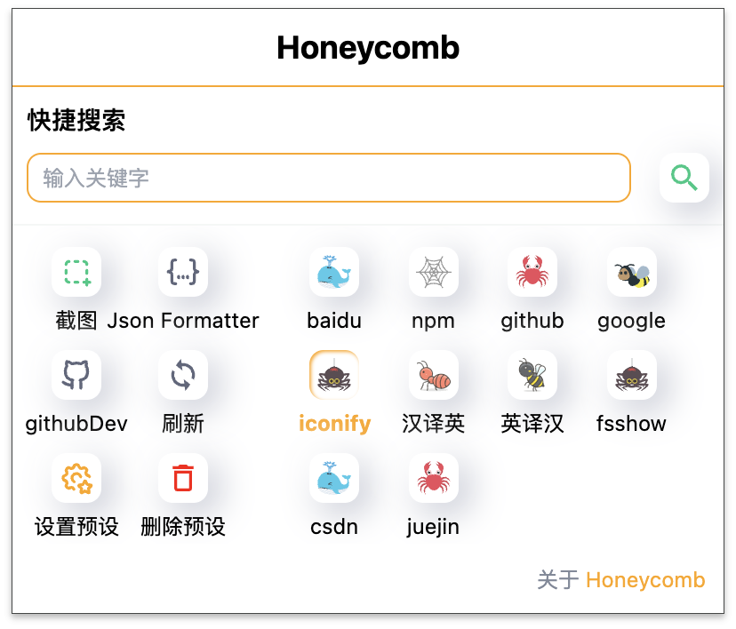

🎩✨ **魔法师的失误与发现**
那天，我在抖音上看到一个前端大佬玩弄`tailwindcss`的浏览器插件，心想：这玩意儿我也能变出来吗！于是我挥动魔杖，发现了`plasmo`这个神器，它让我用`React`就能变出一个浏览器插件。起初，这个项目叫`findDiff`，我梦想着做一个浏览器截图插件，像`snipaste`那样，让前端开发者能一目了然地看出页面效果和设计稿的差别。

🔮 **魔药熬制失败记**
我施法啊施法，搜寻啊搜寻，施法啊施法，结果发现浏览器插件这条路不太好走。我没法像软件那样在不同网页间共享截图，切换网页后，插入`body`的截图就消失了，这似乎没意义...

🧙‍♂️ **巫师的试错之旅**
我尝试了各种咒语，比如用`iframe`嵌入截图，但截图的`iframe`拖不动，也没法在`iframe`里拖动，这个方法也失败了。或者把截图存本地？结果还是一场空。

📣 **向所有巫师和巫女发出挑战**
有想法的小伙伴们，不妨试试，如果你们成功了，记得告诉我哦！😊

🎉 **转变思路，甜蜜的蜂巢诞生**
最后，我放弃了原先的想法，于是就有了`honeycomb`！

## honeycomb

#### 介绍

想象一下，有一个小工具能让你在浏览器里像蜜蜂一样快速穿梭于各种网页，找到你需要的花蜜——信息。这就是`honeycomb`，一个基于[plasmo](https://plasmo.com)的浏览器扩展，它能让你以光速访问和搜索网页内容，支持任何通过URL中GET参数搜索的网站。

#### 为什么叫 honeycomb

选择这个名字是因为蜂巢不仅结构精巧，而且效率极高。就像我们的`honeycomb`扩展一样，简洁、高效，而且蜜蜂是勤劳的象征，正如我们这些勤劳的开发者一样，不停地在信息的花海中采集知识的花蜜！

##### 安装1

1. 🛍️ [点击这里](https://chromewebstore.google.com/search/honeycomb?hl=zh-CN&utm_source=ext_sidebar)直达扩展商店。
2. 🔨 点击`Add to Chrome`按钮，让`honeycomb`成为你的新伙伴。

##### 安装2

1. 🔍 [打开这里](https://github.com/zhengyuxiang/honeycomb)，找到`honeycomb`的家。
2. 📎 点击`Code`按钮，然后选择`Download ZIP`。
3. 📂 解压文件，用vscode打开，运行`pnpm install`安装依赖，再运行`pnpm build`构建项目。
4. 🛠️ 打开`更多工具` -> `扩展程序`。
5. 🎛️ 打开`开发者模式`。
6. 📚 点击`加载已解压的扩展程序`，选择`honeycomb` --> `build` --> `chrome-mv3-prod`文件夹。

### 功能清单

#### 一键导入预设

- 🖹 点击`设置预设`按钮，弹出预设窗口。
- 📥 点击`一键导入预设`按钮，里面预设了一些常用的搜索网站，让你的搜索更快捷。

#### 添加预设

- 🖹 点击`设置预设`按钮，弹出预设窗口。
- 📝 点击`添加预设`按钮，在弹出的窗口中填写`名称`、`url前缀`和`url后缀`，定制你的搜索体验。
  

##### 使用

- 🔍 在搜索框中输入关键字，点击`搜索`按钮或回车，浏览器就会打开搜索结果页面。

#### 区域截图

- 📷 点击`区域截图`按钮，浏览器中打开截图工具，截图完成后，点击`✅`按钮，截图内容会自动填充到剪切板。
  

#### github 一键打开网页vscode查看源码

- 📦 点击`githubDev`按钮，浏览器会自动打开`vscode`，并打开对应的`github`仓库，让你更方便地查看源码。

#### 强制刷新当前页面

- 🔄 点击`刷新`按钮，浏览器会清除当前网页本地『localStorage、sessionStorage、cookie』，强制刷新当前页面，让你看到最新的页面内容。

#### 快捷键

- 🚀 `Alt + O`：打开插件界面，快速开始你的搜索之旅。
-  `Alt + A`：启动区域截图功能，让截图变得简单又快捷。
-  `Alt + C`：强制刷新当前页面，确保你看到的是最新内容。
-  `Alt + G`：一键打开GitHub页面，在VSCode中查看源码，优化你的代码审查流程。

#### 注意

- 📚 本项目仅用于学习交流，别用它做坏事哦。
- 🔍 本项目不提供搜索结果，只提供搜索链接。
- 🌐 搜索结果来自互联网，我们不保证搜索结果的准确性。

#### 贡献

- 👨‍💻 欢迎提交`issue`、`pull request`、`star`、`fork`，让`honeycomb`变得更好。
- 💡 有新点子？提交`issue`，让我们一起讨论。

#### 联系

- 📧 邮箱：2188817393@qq.com
- 🌐 github：[LinHan](https://github.com/LinHanlove)
  有问题？有想法？来找我聊聊吧！

---

👆 以上就是`honeycomb`的介绍，希望你喜欢这个小而美的项目！如果你有任何问题或者想要了解更多，随时欢迎联系我。让我们一起把`honeycomb`做得更好！🌟
