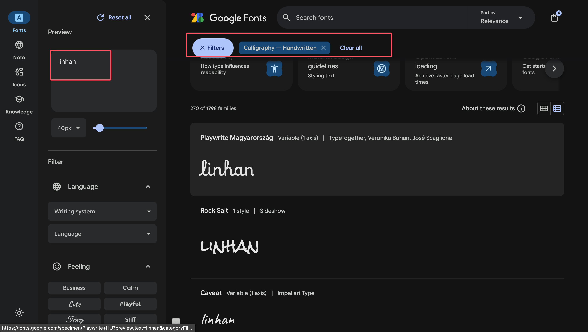
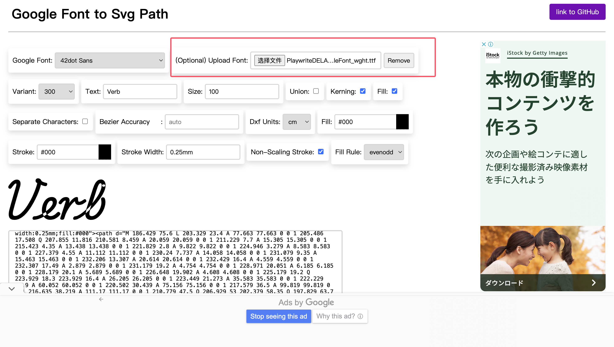

最近，我为网站左上角的徽标进行了一次改版，用动画 SVG 替换了原来的静态图标：

<p flex>
  <a href="/logo.svg" target="_blank" important-border-none p4 ma>
    <Logo class="!w-30 !h-30" />
  </a>
</p>

## 灵感来源

一切要从 [antfu](https://antfu.me/posts/animated-svg-logo) 的个人网站说起。第一次访问他的网站时，我被深深吸引了：「这才是我理想中的个人网站！」

特别是他那个充满设计感的签名体 logo，看过他的实现教程后，我也跃跃欲试。虽然尝试了很多次，但总是差强人意。

直到遇见了 [lxchapu](https://www.lxchapu.com/posts/make-a-beautify-animated-signature/) 的这篇文章，如获至宝！
它完美解答了我的所有困惑。在此特别感谢这两位开发者的分享 🙏

## 实现步骤

### 1. 选择字体

首先访问 [Google Fonts](https://fonts.google.com/)，在筛选器中选择 "Handwriting" 类别，这样就能专注浏览手写字体了。



### 2. 生成 SVG 路径

接下来使用这个很棒的工具：[Google Font to SVG Path](https://danmarshall.github.io/google-font-to-svg-path/)，它
能将 Google Fonts 字体转换为 SVG 路径。



配置说明：

- 字体大小保持默认的 100
- 勾选 "Union" 选项
- 取消勾选 "Non-Scaling Stroke"

> 小技巧：在字体下拉列表中，直接输入字体名可以快速定位到目标字体。

### 3. 获取 SVG 代码

```vue
<svg viewBox="0 0 297 80">
<g>
<path d="xxxxxxxxxxx" />
</g>
</svg>
```

接下来把它添加你的页面上，我们为它添加样式和动画。

CSS 如下：

```css
.animated-signature path {
  stroke-dasharray: 2400;
  stroke-dashoffset: 2400;
  fill: transparent;
  animation: drawSignature 8s linear infinite both;
  stroke-width: 2px;
  stroke: black;
}
```

动画如下：

```css
@keyframes drawSignature {
  0% {
    stroke-dashoffset: 2400;
  }
  15% {
    fill: transparent;
  }
  35%,
  75% {
    stroke-dashoffset: 0;
    fill: black;
  }
  90%,
  to {
    stroke-dashoffset: 2400;
    fill: transparent;
  }
}
```

其实只是用到了 troke-dasharray 属性和 stroke-dashoffset 实现路径动画。

后续我可能还会对我的徽标做更改，但目前来说已经可以满足我了

希望看到您的动画 SVG 徽标！
